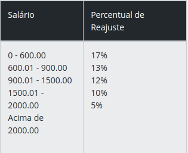

# Atividade 06

A empresa que você trabalha resolveu conceder um aumento salarial a todos funcionários, de acordo com a tabela abaixo:

Leia o salário do funcionário e calcule e mostre o novo salário, bem como o valor de reajuste ganho e o índice reajustado, em percentual.

A entrada contém apenas um valor de ponto flutuante, que pode ser maior ou igual a zero, com duas casas decimais.